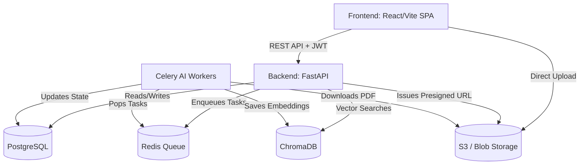
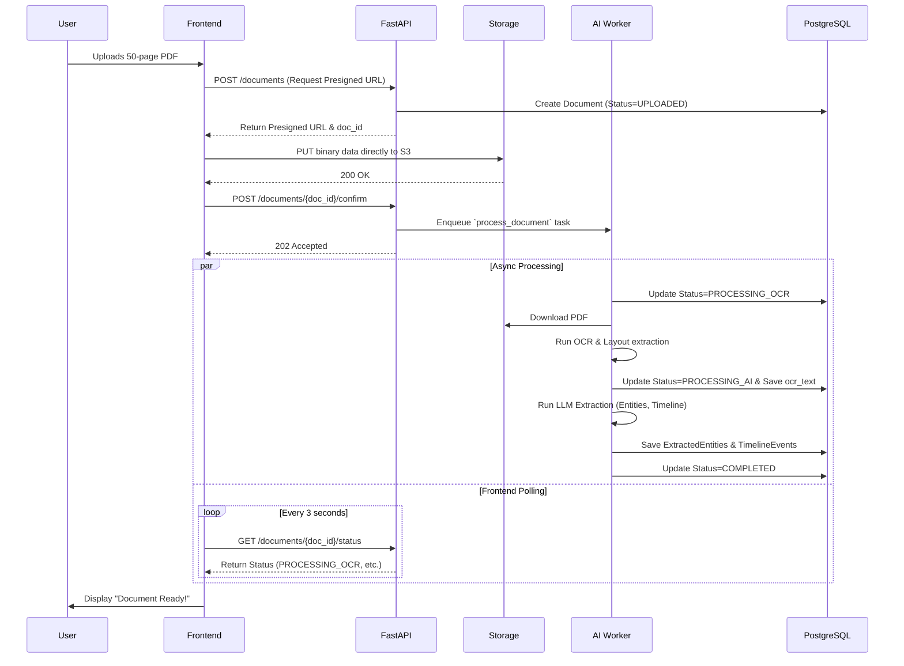
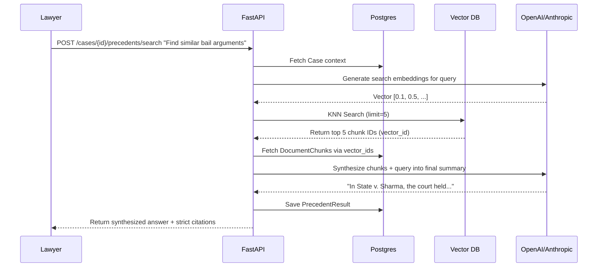

# Architecture & Workflow Blueprinting

This document defines the high-level architecture and data flows for the jurisAssist platform (React + FastAPI + Redis/Celery + ChromaDB + Postgres).

## 1. High-Level Architecture
This represents the physical separation of concerns in our stack.

## 2. Document Upload & Processing Workflow (Happy Path)
Because document OCR and AI extraction are slow, we use an asynchronous queueing pattern.

## 3. Precedent Retrieval Workflow (Phase 5/6)
How we implement grounded retrieval via vector search.

